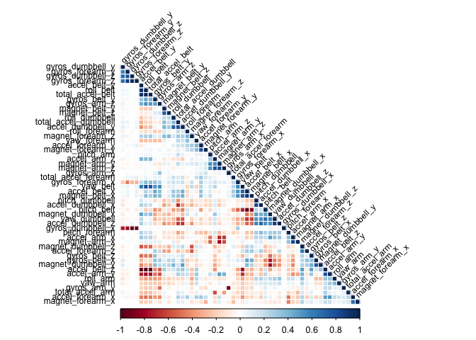

# PracticalMachineLearning
Ivan Marchenko  
22 февраля 2015  
## Data Sources and base information

In this report we will try to predict the quality of an exercise performed by an athlete. The data used in this report comes from the [Human Activity Recognition project](http://groupware.les.inf.puc-rio.br/har). In this study, several athletes were asked to perfrom some weight lefting exercises in 5 different ways, only one of which is the correct way of performing the lefting. The project supplied two datasets, a training and testing datasets. Each of these datasets contain several recordable variables that we will use to predict the outcome classe which represents the class a given exercise belong to. The classe varibale is a factor variable with four levels A,B,C,D,E. These levels are supplied in the training dataset but not in the testing dataset. In this study we will be trying to predict the classe for each of the 20 observations provided in the testing dataset.

## Processing Test & traim data


```r
train <- read.csv("http://d396qusza40orc.cloudfront.net/predmachlearn/pml-training.csv", na.strings=c("NA","#DIV/0!",""), stringsAsFactors=FALSE)
test <- read.csv("http://d396qusza40orc.cloudfront.net/predmachlearn/pml-testing.csv", na.strings=c("NA","#DIV/0!",""), stringsAsFactors=FALSE)
```

There are a lot column of NA data, remove it to exclude from model. Row number and first 6 variables not give relevant information for prediction (names,time). Classe variable must be converted to factor.


```r
Naremove <- sapply(colnames(train), function(x) 
        if(sum(is.na(train[, x])) > 0.50*nrow(train))  
        {return(TRUE)
        }else{
        return(FALSE)
        })
train <- train[, !Naremove]
train <- train[,-c(1:7)]
train$classe <- as.factor(train$classe)
```

```r
dim(train)
```

```
## [1] 19622    53
```

After this manipulations train dataset contains only 53 variables.

## Define Cross Validation and Training sets

For training purposes we will be splitting the cleaned dataset in two sets, one for training and one for cross validation. The cross validation dataset wil contain 30% of the cleaned training dataset and the smaller training dataset will contain the rest, 70% of the dataset. The reason for this is that after we obtain our model, we have to use the cross validation data to test the accuracy of our model.


```r
library(caret)
```

```
## Loading required package: lattice
## Loading required package: ggplot2
```

```r
set.seed(12345)
InTrain <- createDataPartition(train$classe, p = 0.7, list=FALSE)
TrueTrain <- train[InTrain,]
Crossval <- train[-InTrain,]
```

## Find Correlated Variables


```r
library(corrplot)
corMat <- cor(TrueTrain[,-dim(TrueTrain)[2]],)
corrplot(corMat, method = "color", type="lower", order="hclust", tl.cex = 0.75, tl.col="black", tl.srt = 45)
```

 

Remove variables with correlation greater than 0.5  The final training dataset contains 22 variables, 21 predictor variables and one outcome.


```r
highlyCor <- findCorrelation(corMat, cutoff = 0.5)
TrueTrain <- TrueTrain[,-highlyCor]
ncol(TrueTrain)
```

```
## [1] 22
```

## Training Random Forest Model

As We try to predict factor variable Random Forest is one of the best method to build the model.


```r
library(randomForest)
```

```
## randomForest 4.6-10
## Type rfNews() to see new features/changes/bug fixes.
```

```r
tc <- trainControl(method = "cv", number = 5, verboseIter=FALSE , preProcOptions="pca", allowParallel=TRUE)
RFFit <- train(classe ~ ., data = TrueTrain, method = "rf", trControl= tc)
```

## Model Validation on the Cross Validation Dataset

Accuracy of my model is 97.74% and out-of-sample error 2.25%


```r
ValPredict <- predict(RFFit, newdata=Crossval)
confMat <- confusionMatrix(ValPredict, Crossval$classe)
confMat$table
```

```
##           Reference
## Prediction    A    B    C    D    E
##          A 1665   21    1    0    0
##          B    7 1101   21    2    0
##          C    0   12  991   34    0
##          D    2    0   12  924    2
##          E    0    5    1    4 1080
```

```r
Accuracy <- sum((ValPredict==Crossval$classe))/dim(Crossval)[1]
Accuracy
```

```
## [1] 0.9789295
```

## Answers for submission


```r
answers <- predict(RFFit,newdata=test)
answers
```

```
##  [1] B A B A A E D B A A B C B A E E A B B B
## Levels: A B C D E
```
